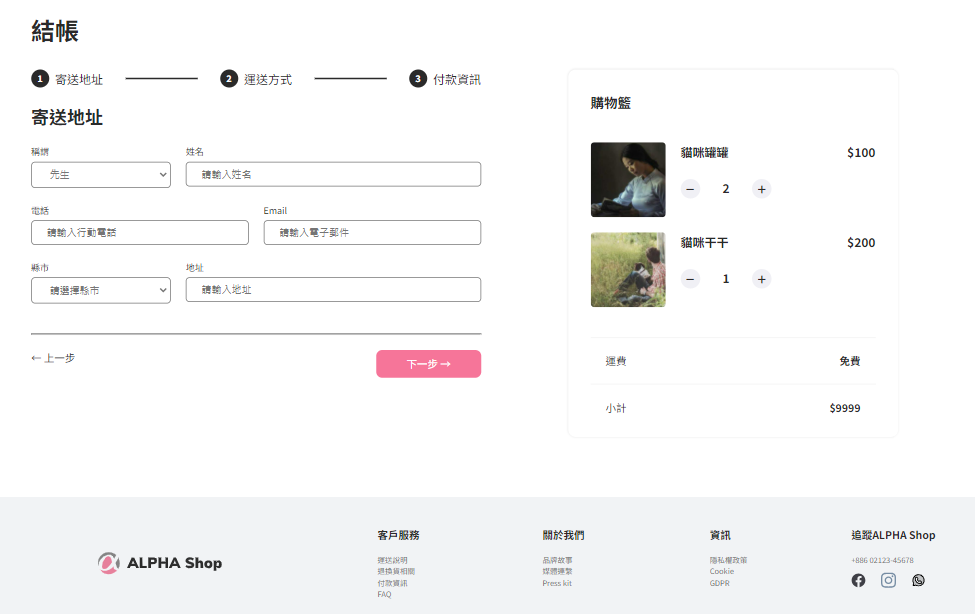

# ALPHA SHOP

使用 React 框架打造出的電商購物網站


### 將網頁拆分成 Component

運用框架特性，將網頁上的元件拆成一個一個小的 component，以利日後維護與更新

### CSS Module

採用每個 component 有自己 module.css 的 CSS 寫法，清楚將 CSS 分開

### SCSS

使用 pre-processor，讓 code 更便於管理。設定主題顏色，使網頁保留更多彈性，未來可以一鍵更換網頁風格。

## 安裝與下載

下載檔案至本地資料夾

```
git clone https://github.com/fishiryoma/AC_shop
```

開啟專案資料夾後安裝檔案

```
npm install
```

輸入執行碼

```
npm run dev
```

於瀏覽器輸入以下網址

```
http://127.0.0.1:3000/
```

## 使用工具與版本

- Node.js v16.20.0
- React v18.2.0
- Vite v5.0.8
- Sass v
